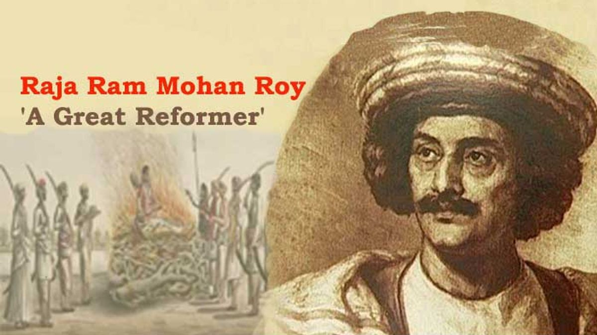
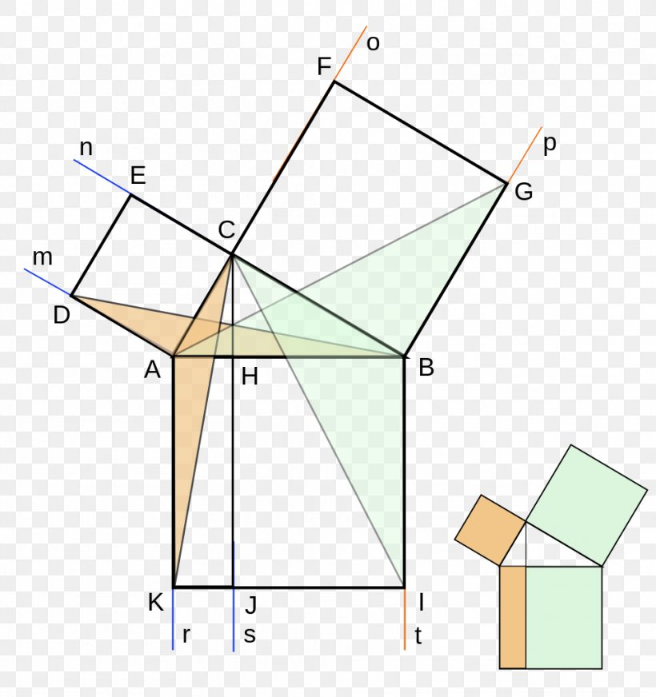

# Output of work done by people
Which might help in triggering the de-conditioning process for yourself.

_Note: Keep your beliefs aside and be open and think using your common sense._

  
[Alan Turing](http://mileswmathis.com/turing.pdf) by Miles Mathis.

  
[Raja Ram Mohan Roy](topic/sati) by Abhijit Chavda.  

  
[Euclid](http://ckraju.net/papers/Euclid.pdf) by C.K Raju.

  
[Debate on removing term 'Pythagorean theorem' from school texts](https://youtu.be/FUL686pgLY8) by C.K Raju.

[Jonathan Crabtree: a dangerous fraud](http://ckraju.net/blog/?p=212) by C.K Raju.
