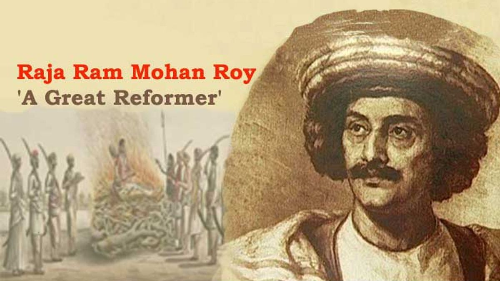

  

<iframe width="560" height="315" src="https://www.youtube.com/embed/ivUv32ynD4Q" title="YouTube video player" frameborder="0" allow="accelerometer; autoplay; clipboard-write; encrypted-media; gyroscope; picture-in-picture" allowfullscreen></iframe>

## Some of the comments from people of Bharat

1. I am from a Rajput family, no one has committed sati in my family.I used to glorify ram mohan Roy but sir you opened my eyes.
I'm thankful to Gurudev Abhijit chavda ji that this video is reaching to many of the Indians.

2. I am from Rajasthan, and in our family we never had anyone doing sati ..all women died naturally...we worship a goddess call Mata Sati, and that's it

3. I am a Bengali still living in kolkata and I am fond of Bengali literature and I have read every Bengali author you can name... Not a single Author writes about the instance of Sati, yet the British claimed that Sati was majorly practiced in Bengal......

4. I am from Bengal myself and I asked the same question to my great grand mother 7-8  years back (She is no more unfortunately) that if she witnessed or heard of such practice from her own parents or grandparents.  The answer is the same, "They (Her elders) heard this but never seen this happening to any close relative of theirs". I wanna add one more thing here. If you ever go through any Mangal Kavya like Manasa Mangal, Chandi Mangal, Dharma Mangal which are gems of Bengali literature from Medieval Age  you won't find any mention of this forced immolation (Which is called 'Sati daho Protha' in Bengali).

## Think for yourself